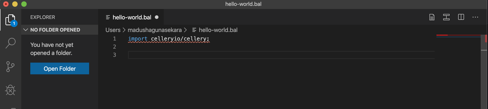

# Cellery extension for Visual Studio Code

The Cellery VS Code extension makes it easy to write cell files by providing code suggestions and snippets.
This extension also provides deployment support for cellery with build, run and test commands.

---

## Prerequisites

Download and install relevant releases according to your system.

1. [Cellery - v0.6.0](https://cellery.io/downloads)
2. [Ballerina - v1.0.3](https://ballerina.io/downloads/)

> Note: Ballerina VS Code extension automatically will be installed when installing the Cellery VS Code extension.

---

## Features

### Language support

Cellery is based on [Ballerina](https://ballerina.io/) and all the [Ballerina related tooling support](https://ballerina.io/learn/tools-ides/vscode-plugin/language-intelligence) is available
when writing the cell files.

#### Cellery Specific Language Support

In order to have Cellery specific language support, it is required to import `celleryio/cellery` module at the beginning
of the cell file.

That's it! now you have all the Cellery related language support to write your cell file.
Following is a small demo which is showing the power of the Cellery VS Code plugin.

### Deployment support

VS Code extension for cellery helps users to deploy their cells through VS Code commands. You can open up the VS Code
command palette and type `cellery` to see available commands. You will see three commands provided by this extension.

- Build Command:

This will build a cell image using the cell file which is currently in the focused tab. Users need to provide cell image
name as an input.

- Run Command:  

User can use this command to build and run the cell file which is currently in the focused tab. Cell image name and 
cell instance name are required as inputs.

- Test Command:

Cell testing can be easily executed by using this command. Test command also requires cell image name as an input.

---

## Contributing

The Cellery Team is pleased to welcome all contributors willing to join with us in our journey. Please send PRs for
any bug fixes, features, or design changes you made for cellery tooling to [this repository](https://github.com/wso2/cellery-tooling).

If you are willing to contribute to Cellery, please follow [this guild](https://github.com/wso2/cellery/blob/master/CONTRIBUTING.md#contribute-to-cellery)
for guidelines.

---

## Issue Reporting

We use GitHub issues to track all of our bugs and feature requests. Please feel free to open an issue
(Using `component/tooling` label) about any question, bug report or feature request that you have in mind.

---

## License

[Apache-2.0](https://github.com/wso2/cellery-tooling/blob/master/LICENSE)

---

